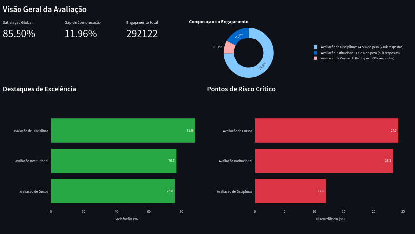
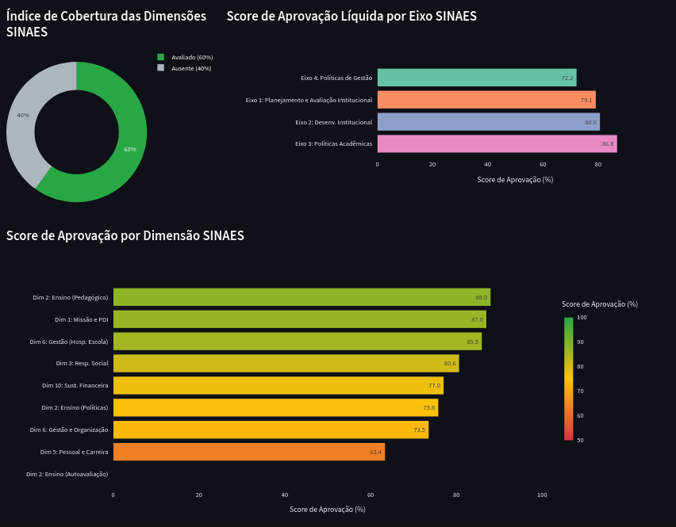
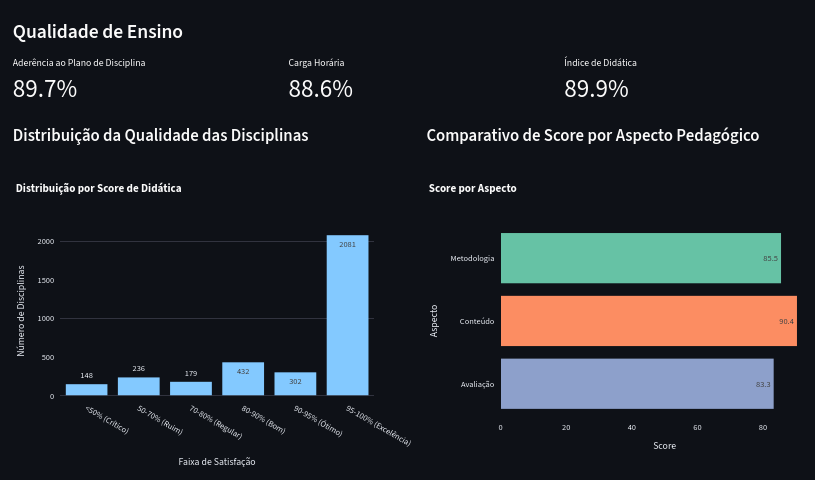
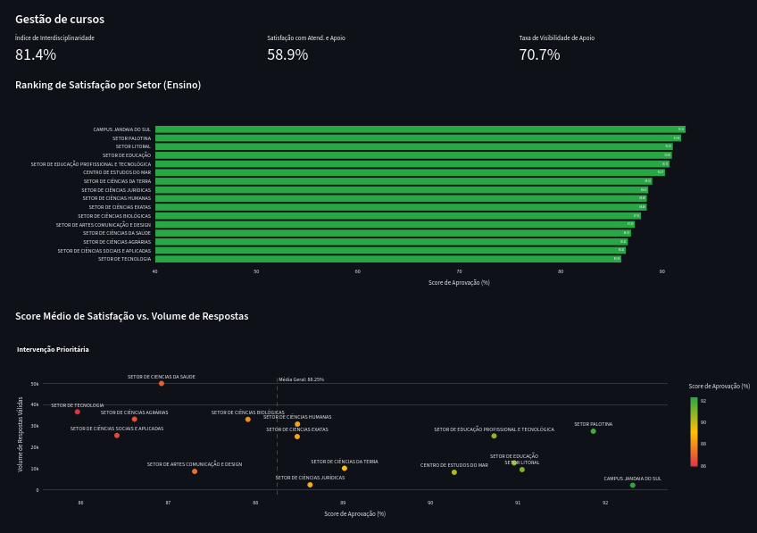
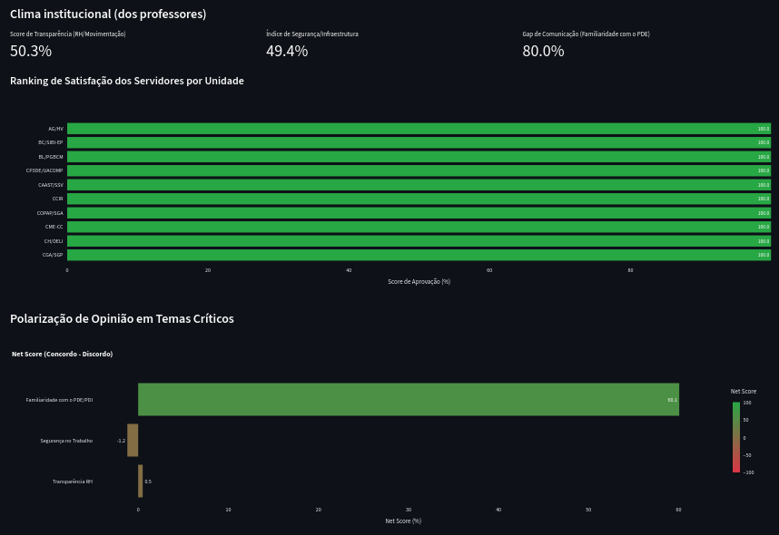

# Dashboard & Chat RAG - Dados UFPR

Este projeto é uma aplicação Streamlit que combina um Dashboard de visualização de dados (Excel/CSV) com um Chatbot inteligente híbrido (RAG + Análise de Dados) capaz de responder perguntas sobre os documentos e realizar análises quantitativas.

## Funcionalidades

- **Dashboard**: Visualização de planilhas Excel e CSV localizadas na pasta `data/`.
- **Chat RAG Híbrido**: Assistente de IA (Gemini 2.5 Flash Live) que combina:
  - **Análise de Dados**: Cálculos, agregações e rankings usando Pandas
  - **Busca Semântica**: Respostas conceituais baseadas em documentos (PDFs, Excel, CSV)
  - **Auto-Join**: Resolução automática de códigos para nomes legíveis (ex: COD_CURSO → CURSO)
- **Indexação Otimizada**: Processamento de arquivos com barra de progresso e estimativa de tempo (ETA).
- **Persistência**: O índice é salvo em disco (`storage/`) para carregamento instantâneo nas próximas execuções.

## Acesso Online
O aplicativo pode ser acessado online no seguinte link: https://itape.wired.rs

## Como Executar

### Rodando com Docker (Recomendado)

Esta aplicação está containerizada para facilitar a execução.

#### Pré-requisitos
- Docker e Docker Compose instalados.
- Git LFS instalado (para baixar os arquivos de índice).

#### Instalando o Docker (Ubuntu/Linux)

Se você ainda não tem o Docker instalado, siga os passos abaixo ou consulte a [documentação oficial](https://docs.docker.com/engine/install/).

1.  **Atualize os pacotes**:
    ```bash
    sudo apt-get update
    sudo apt-get install ca-certificates curl gnupg
    ```

2.  **Adicione a chave GPG oficial do Docker**:
    ```bash
    sudo install -m 0755 -d /etc/apt/keyrings
    curl -fsSL https://download.docker.com/linux/ubuntu/gpg | sudo gpg --dearmor -o /etc/apt/keyrings/docker.gpg
    sudo chmod a+r /etc/apt/keyrings/docker.gpg
    ```

3.  **Configure o repositório**:
    ```bash
    echo \
      "deb [arch="$(dpkg --print-architecture)" signed-by=/etc/apt/keyrings/docker.gpg] https://download.docker.com/linux/ubuntu \
      "$(. /etc/os-release && echo "$VERSION_CODENAME")" stable" | \
      sudo tee /etc/apt/sources.list.d/docker.list > /dev/null
    ```

4.  **Instale o Docker Engine**:
    ```bash
    sudo apt-get update
    sudo apt-get install docker-ce docker-ce-cli containerd.io docker-buildx-plugin docker-compose-plugin
    ```

5.  **Verifique a instalação**:
    ```bash
    sudo docker run hello-world
    ```

> **Nota**: Para instalar no Windows ou Mac, baixe o [Docker Desktop](https://www.docker.com/products/docker-desktop/).

#### Passo a Passo

1.  **Clone o repositório e baixe os arquivos grandes**:
    ```bash
    git clone https://github.com/DEST-UFPR/hackathon-ufpr-itape.git
    cd hackathon-ufpr-itape
    git lfs install
    git lfs pull
    ```

2.  **Configuração**:
    -   Edite o arquivo `docker-compose.yml` e insira sua chave de API do Google
        Você pode gerá-la acessando: https://aistudio.google.com/api-keys

3.  **Executar**:
    ```bash
    docker compose up --build
    ```

4.  **Acessar**:
    -   Acesse `http://localhost:8501` no seu navegador.

#### Observação sobre Persistência
A pasta `storage/` é mapeada como um volume, então o índice gerado pela IA será persistido mesmo se você destruir o container. Se você adicionar novos arquivos na pasta `data/`, pode ser necessário reiniciar o container ou rodar o script de reindexação.

### Rodando Localmente (Desenvolvimento)

1.  **Instalar dependências**:
    ```bash
    uv sync
    ```

2.  **Configurar variáveis de ambiente**:
    - Crie um arquivo `.env` na raiz do projeto
    - Adicione o token ao `.env`: `GOOGLE_API_KEY=<chave-google>`

3.  **Executar aplicação**:
    ```bash
    uv run streamlit run app.py
    ```

4.  **Rodar testes** (opcional):
    ```bash
    # Testar análise de dados
    uv run python tests/test_rag_system.py
    
    # Testar auto-join de nomes
    uv run python tests/test_auto_join.py
    
    # Testar conexão com LLM
    uv run python tests/test_llm.py
    ```

## Modelagem e Tratamento dos Dados

Os dados brutos foram remodelados para o padrão _Star Schema_, otimizando a performance e a clareza analítica. O conjunto de dados original foi transformado nas seguintes tabelas:

### Tabelas Fato:
```
FATO_AVCURSOS         - Respostas da avaliação de cursos
FATO_AVDISCIPLINAS    - Respostas da avaliação de disciplinas
FATO_AVINSTITUCIONAL  - Respostas da avaliação institucional
```

### Tabelas Dimensão:
```
DIM_CURSOS                 - Informações dos cursos
DIM_DISCIPLINAS            - Catálogo de disciplinas
DIM_PERGUNTAS              - Texto e classificação das perguntas
DIM_TIPO_PERGUNTA_SINAES   - Taxonomia SINAES
DIM_UNIDADES               - Setores e centros da UFPR
```

A relação entre as tabelas é feita principalmente através das colunas `ID_PERGUNTA`, `ID_QUESTIONARIO`, `COD_CURSO`, `COD_DISCIPLINA` e `SIGLA_LOTACAO`.

## Arquitetura do Chat RAG Híbrido

O assistente de IA utiliza um agente ReAct que escolhe automaticamente entre:

1. **Ferramentas de Análise de Dados** (para perguntas quantitativas):
   - `calculate_satisfaction`: Calcular satisfação (% Concordo)
   - `count_responses`: Contar respostas
   - `get_top_bottom`: Rankings (top/bottom N)
   - `join_and_analyze`: Relacionar tabelas e analisar
   - `get_table_schema`: Ver estrutura das tabelas

2. **Busca Semântica** (para perguntas conceituais):
   - `semantic_search`: Buscar informações em PDFs e documentos

### Exemplos de Perguntas

**Análise de Dados:**
- "Quais os 5 cursos com maior satisfação?"
- "Qual a média de satisfação das disciplinas?"
- "Quantas respostas 'Desconheço' temos na avaliação institucional?"

**Busca Semântica:**
- "O que é SINAES?"
- "Explique a metodologia da avaliação"
- "Quais são os eixos avaliativos?"

## Dashboards Analíticos

Foram desenvolvidos cinco dashboards interativos para facilitar a visualização e aprofundamento das análises.

1. **Página Inicial:**
    - **Foco Analítico:** Panorama imediato da satisfação e engajamento.
    - **Indicadores-Chave:** Satisfação Média Geral, Engajamento Total (Contagem de Respostas), Gap de Comunicação (% de "Desconheço"), Destaques e Pontos de Risco.
    


2. **SINAES:**
    - **Foco Analítico:** Conformidade e score institucional nos 5 Eixos Avaliativos
    - **Indicadores-Chave:** Cobertura das Dimensões do SINAES, Score de Aprovação por Eixo e por Dimensão.
    

3. **Qualidade de Ensino:**
    - **Foco Analítico:** Avaliação do processo de ensino-aprendizagem
    - **Indicadores-Chave:** Aderência ao Plano de Disciplina, Carga Horária, Índice de Didática, Histograma de Faixa de Satisfação e Comparativo de Score Pedagógico.
    

4. **Gestão de Cursos:**
    - **Foco Analítico:** Análise da estrutura curricular, apoio e resultados por unidade
    - **Indicadores-Chave:** Interdisciplinaridade, Satisfação com Atendimento e Apoio, Taxa de Visibilidade de Apoio, Ranking de Satisfação por Setor e Gráfico de Dispersão (Score x Volume de Respostas).
    

5. **Clima Institucional:**
    - **Foco Analítico:** Percepção dos servidores sobre gestão e infraestrutura.
    - **Indicadores-Chave:** Score de Transparência (RH/Movimentação), Índice de Segurança/Infraestrutura, Gap de Comunicação (Familiaridade com PDE), Ranking de Satisfação dos Servidores e Polarização de Opiniões (Net Score).
    

## Próximos Passos dos dados
- Adição de Análise de Cluster para identificação de perfil de respondente
- Detecção de Outliers com Isolation Forest


## Estrutura do Projeto

```
hackathon-ufpr-dados-2025/
├── app.py                      # Ponto de entrada da aplicação
├── data/                       # Dados CSV/Excel/PDF
├── storage/                    # Índice vetorial persistido
├── tests/                      # Scripts de teste
│   ├── test_rag_system.py      # Testa análise de dados
│   ├── test_auto_join.py       # Testa auto-join de nomes
│   └── test_llm.py             # Testa conexão com LLM
├── src/
│   ├── main.py                 # Configuração principal
│   ├── components/             # Componentes da UI
│   │   ├── chat.py             # Interface do chat
│   │   └── dashboards/         # Dashboards analíticos
│   ├── services/
│   │   ├── rag_engine.py       # Motor RAG híbrido
│   │   ├── data_tools.py       # Ferramentas de análise
│   │   └── table_metadata.py   # Metadados das tabelas
│   └── utils/
│       └── generate_index.py   # Geração do índice vetorial
├── docker-compose.yml
├── Dockerfile
└── README.md
```

## Tecnologias Utilizadas

- **Frontend:** Streamlit
- **LLM:** Google Gemini 2.5 Flash Live
- **Embeddings:** Google Text Embedding 004
- **Framework RAG:** LlamaIndex
- **Análise de Dados:** Pandas
- **Containerização:** Docker

